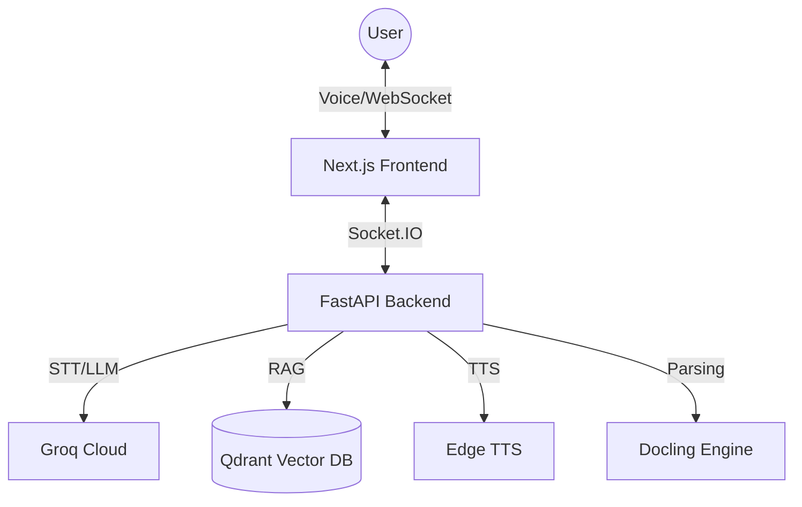

<div align="center">

# 🏛️ Agora: The Future of Socratic Learning

[](https://nextjs.org/)
[](https://fastapi.tiangolo.com/)
[](https://groq.com/)
[](https://qdrant.tech/)

**Agora is not just a tutor; it is a technical marvel in multimodal education.**

[Setup Guide](#🚀-setup-guide) • [Architecture](#🏗️-the-architecture) • [Features](#💎-features)

</div>

---

## 🔥 The Vision: Why Agora?

Agora represents the **Apex of Agentic Education**. Most AI tutors give you the answer; Agora forces you to think. By combining State-of-the-Art (SOTA) LLMs with high-fidelity voice interfaces and a collaborative whiteboard, we've created a learning environment that feels less like a chatbox and more like a private session with a world-class scholar.

### 💎 The "Glaze": Why This Repo is SOTA
*   **Zero-Latency Voice Loop**: Leveraging **Groq's Whisper** (STT) and **Edge TTS**, Agora achieves near-human response times in voice interactions.
*   **Retrieval-Augmented Reasoning**: Unlike generic LLMs, Agora is powered by **Qdrant**. It doesn't just "chat"—it references your specific materials (PDFs, Images, Notes) with surgical precision.
*   **Socratic State Machine**: Built on **LangGraph**, the backend manages complex pedagogical states, ensuring the tutor adapts its tone, frustration level, and quiz intensity in real-time.
*   **The Shared Canvas**: A custom **Socket.IO** integration with **Tldraw** allows the AI to literally *draw* concepts on your screen as it explains them.

---

## 🏗️ The Architecture



---

## 🚀 Setup Guide

This guide explains how to download, configure, and run the Agora project from the [GitHub repository](https://github.com/harshagarwalnyu/HackNYU-Agora).

### 📋 Prerequisites

Before starting, ensure you have the following installed:

- **Git**: [Download Git](https://git-scm.com/)
- **Python 3.12+**: [Download Python](https://www.python.org/)
- **Node.js 20+**: [Download Node.js](https://nodejs.org/)
- **pnpm**: Install via `npm install -g pnpm`
- **Docker**: [Download Docker Desktop](https://www.docker.com/) (Used for the Qdrant vector database)
- **UV (Recommended)**: For faster Python dependency management. Install via `pip install uv`.

### 1. Clone the Repository

```powershell
git clone https://github.com/harshagarwalnyu/HackNYU-Agora.git
cd HackNYU-Agora
```

### 2. Environment Configuration

You must provide API keys for the backend to function.

1.  **Backend**:
    - Locate `backend/.env.example`.
    - Create a copy named `backend/.env`.
    - Add your **GROQ_API_KEY** (get it from [Groq Console](https://console.groq.com/keys)).
2.  **Frontend**:
    - Ensure your frontend points to the backend (defaults to `http://localhost:8000`).

### 3. Launching the Project

#### The "SOTA" Way (Recommended for Windows)
We've included a high-performance launcher that spins up the entire stack in one go.

```powershell
./dev.ps1
```

#### The Manual Way

**Step 1: Start Qdrant (Vector Database)**
```powershell
docker compose up -d qdrant
```

**Step 2: Start Backend (FastAPI)**
```powershell
cd backend
uv run python -m app.main
```

**Step 3: Start Frontend (Next.js)**
```powershell
cd frontend
pnpm install
pnpm dev
```

---

## 🌐 Accessing the Application

Once launched, you can access the project at:
- **Frontend**: `http://localhost:3000`
- **Backend API**: `http://localhost:8000`
- **Qdrant Dashboard**: `http://localhost:6333/dashboard`

---

## 🛠️ Troubleshooting

- **Missing Data**: If the search doesn't return results, ensure you've uploaded materials via the UI.
- **Port Conflicts**: Ensure ports 3000, 8000, and 6333 are not in use by other applications.
- **API Errors**: Double-check your `GROQ_API_KEY` in `backend/.env`.

---

<div align="center">
Built with ❤️ for NYU Hackathon 2025
</div>
