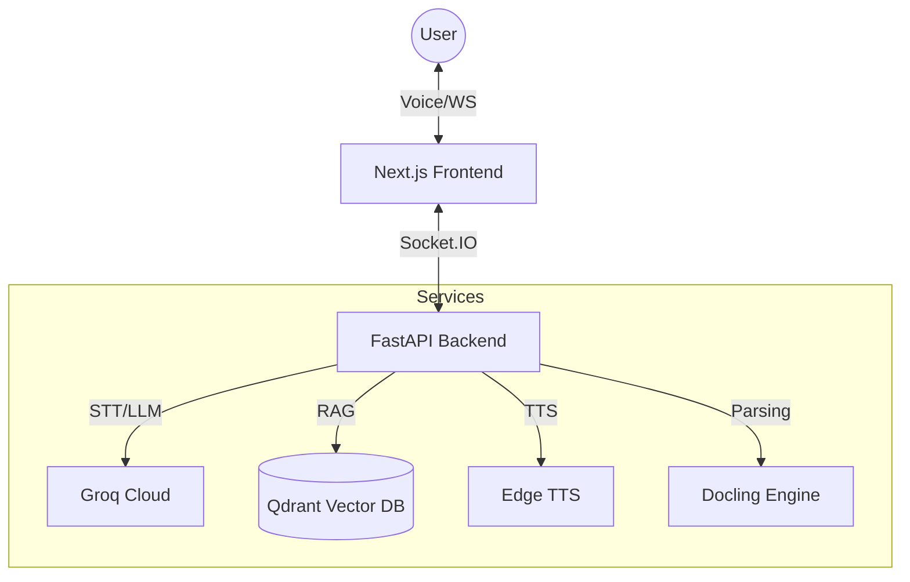

<div align="center">

# 🏛️ Agora

**The Future of Socratic Learning — Voice‑First & Retrieval‑Augmented.**

[](https://nextjs.org/)
[](https://fastapi.tiangolo.com/)
[](https://groq.com/)
[](https://qdrant.tech/)
[](https://opensource.org/licenses/MIT)

[Features](#💎-features) • [Architecture](#🏗️-architecture) • [Getting Started](#🚀-getting-started) • [Tech Stack](#🛠️-tech-stack) • [Contributing](#🤝-contributing)

</div>

---

## 📖 Introduction

Agora is the **Apex of Agentic Education**. It moves beyond standard "instructional" AI to provide a true Socratic tutoring experience. By combining State-of-the-Art (SOTA) LLMs with high-fidelity voice interfaces and a collaborative whiteboard, Agora creates a learning environment that monitors student frustration and provides targeted, retrieval-augmented guidance.

## 💎 Features

*   **🎙️ Zero-Latency Voice Loop**: leverages **Groq's Whisper** (STT) and **Edge TTS** for near-instant human-like verbal interaction.
*   **🧠 Socratic Reasoning Engine**: Powered by **LangGraph**, the backend manages pedagogy states, ensuring the tutor prompts the student to think rather than just giving answers.
*   **📚 Retrieval-Augmented Generation (RAG)**: Integrates with **Qdrant** to provide contextually relevant responses based on *your* uploaded materials (PDFs, Images, Notes).
*   **🎨 Collaborative Whiteboard**: Real-time integration with **Tldraw** via **Socket.IO** allowing the AI to draw and highlight concepts synchronously with the student.
*   **⚡ High-Performance Parsing**: Uses **Docling** for deep document structure extraction from complex PDFs and images.

---

## 🏗️ Architecture



---

## 🚀 Getting Started

Follow these instructions to set up your local development environment.

### 📋 Prerequisites

- **Git**: [Download Git](https://git-scm.com/)
- **Python 3.12+**: [Download Python](https://www.python.org/)
- **Node.js 20+**: [Download Node.js](https://nodejs.org/)
- **pnpm**: `npm install -g pnpm`
- **Docker**: [Download Docker](https://www.docker.com/) (Required for Qdrant)
- **UV**: For high-speed Python dependency management. Install via `pip install uv`.

### 1. Clone & Install

```powershell
git clone https://github.com/harshagarwalnyu/HackNYU-Agora.git
cd HackNYU-Agora
```

### 2. Environment Configuration

1.  **Backend**: Copy `backend/.env.example` to `backend/.env`.
2.  **API Keys**: Enter your **GROQ_API_KEY** in `backend/.env`. Get one [here](https://console.groq.com/keys).

### 3. Launching

#### Quick-Start (Windows Recommended)
```powershell
./dev.ps1
```

#### Manual Start
1.  **Start Services**: `docker compose up -d qdrant`
2.  **Backend**: `cd backend && uv run python -m app.main`
3.  **Frontend**: `cd frontend && pnpm install && pnpm dev`

---

## 🛠️ Tech Stack

- **Frontend**: Next.js 15, Tailwind CSS, Zustand, Tldraw, Socket.IO Client.
- **Backend**: FastAPI, LangGraph, Pydantic, Docling, Python-SocketIO.
- **Persistence**: Qdrant (Vector Database).
- **Inference**: Groq (Llama 3.3 / Whisper), Edge TTS.

---

## 🤝 Contributing

We welcome contributions! Please follow these steps:
1.  **Fork** the project.
2.  Create your **Feature Branch** (`git checkout -b feature/AmazingFeature`).
3.  **Commit** your changes (`git commit -m 'Add some AmazingFeature'`).
4.  **Push** to the branch (`git push origin feature/AmazingFeature`).
5.  Open a **Pull Request**.

## 📜 License

Distributed under the **MIT License**. See `LICENSE` for more information.

---

<div align="center">
Built for NYU Hackathon 2025
</div>
